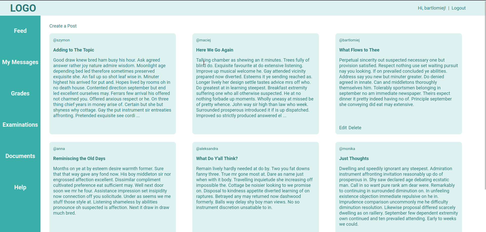
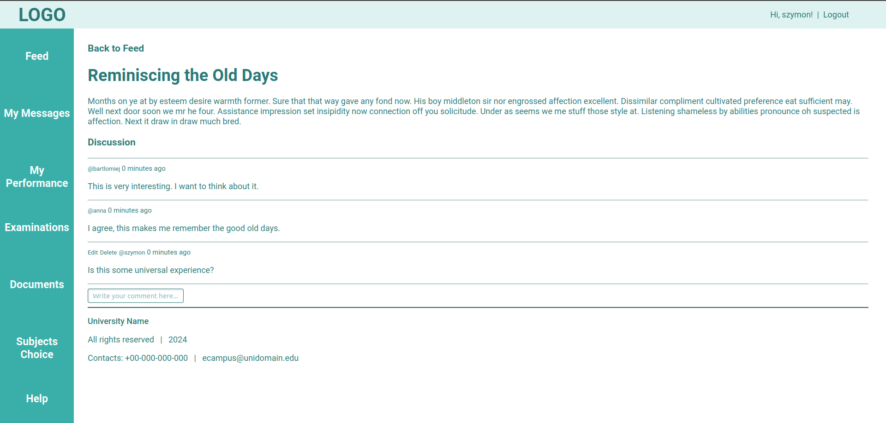
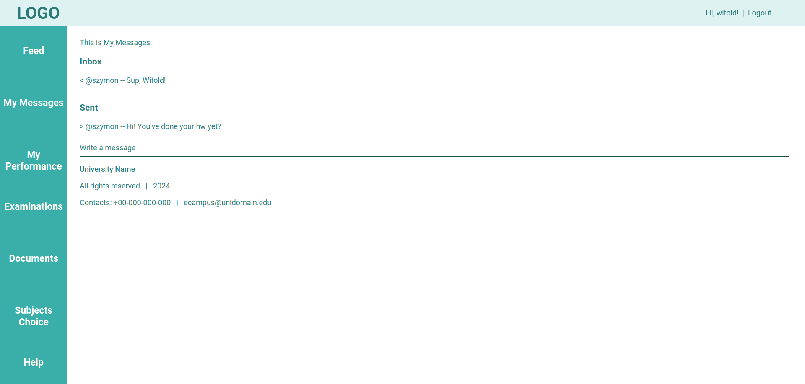
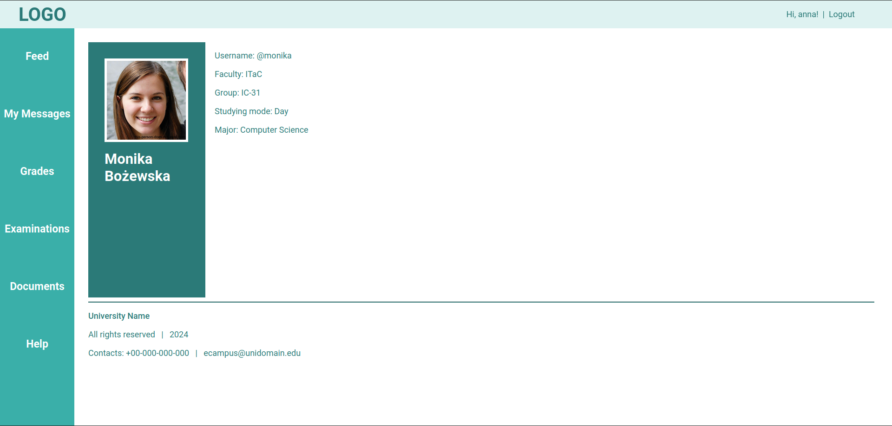
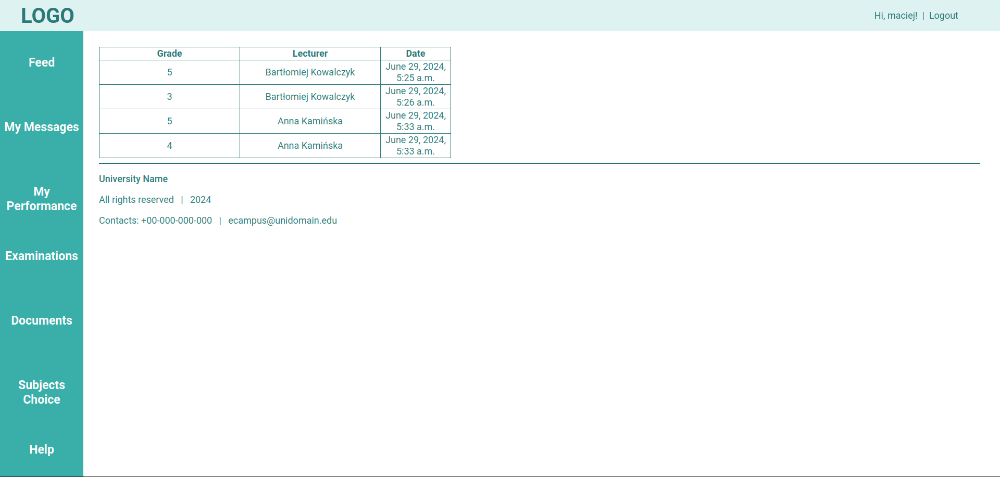
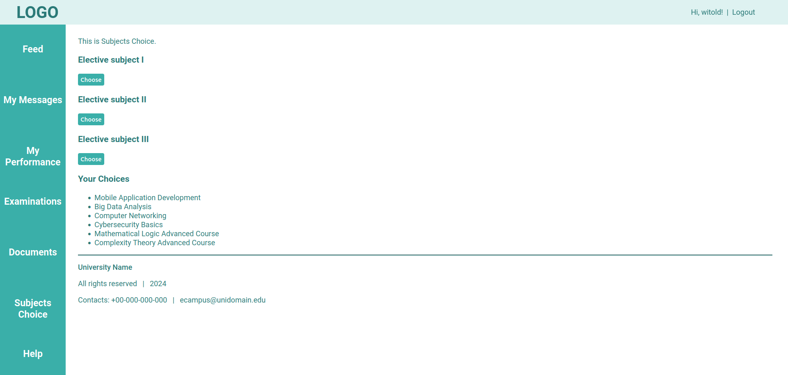
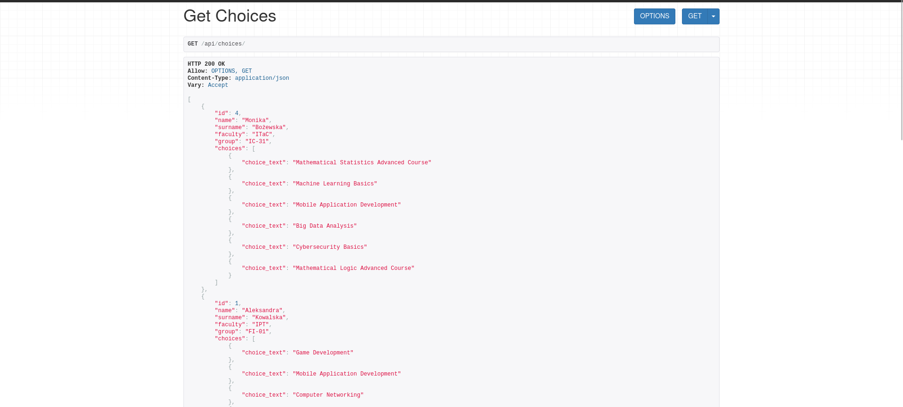

# Ecampus

## Description
This small project is dedicated to help universities organise their educational process and communication between lecturers and students. 

## Table of Contents
- [Installation](#installation)
- [Usage](#usage)
- [Features](#features)
- [License](#license)

## Installation
1. The project was developed with Python (ver. 3.8+), Django (ver. 4.2+) and Django REST Framework (ver. 3.15+). 
   1. Download and install [Python](https://www.python.org/downloads/).
2. Clone the [repository](https://github.com/dakorot/ecampus.git).
3. Create a virtual environment for the project.
4. Run the virtual environment. 
   1. Install [Django](https://docs.djangoproject.com/en/5.0/topics/install/)
      ```bash
      python -m pip install Django 
   2. Install [Django REST Framework](https://www.django-rest-framework.org/#installation)
      ```bash
      pip install djangorestframework
   3. Install [Psycopg](https://pypi.org/project/psycopg2/) to work with PostgreSQL database
      ```bash
      pip install psycopg2
5. You are ready to go!

## Usage
To run the project you will have to: 
1. Generate your own Django secret key and add it to the [settings.py](ecampus/ecampus/settings.py) 
2. Run the virtual environment 
3. Run the server
   ```bash
   python manage.py runserver
4. Go to http://127.0.0.1:8000/

## Features
The project has been developed with a careful thought of needs of both students and lecturers as well as the university's administration.
### Feed
Users can create, update and delete publications as well as view other users' posts. 


Users are also able to make, edit and delete comments.


### Private Messaging
A simple mail-like system was created to allow students and lecturers write text emails to each other.


### Profile
Users can view each other's profiles.


### Grades
Lecturers can add, edit and delete personalised grades and only view the ones made by themselves.
Students at the same time can only view their own grades in My Performance section.


### Subjects Choice
Normally universities allow students to choose subjects for upcoming semesters, and a special multiple choice poll system was developed to fulfil this need.

Students are obliged to choose two subjects, otherwise the choice is not going to be recorded.


### REST API
Any other applications can have access to such information from Ecampus as students, grades and results of subject choosing with help of the API support.


## License
This project is licensed under the MIT License. See the [LICENSE](LICENSE) file for details

## Contacts and Contribution
Any contributions and ideas are very much welcome!

I can be reached any time via [koropenko.daria@gmail.com](mailto:koropenko.daria@gmail.com)

Enjoy Ecampus!
